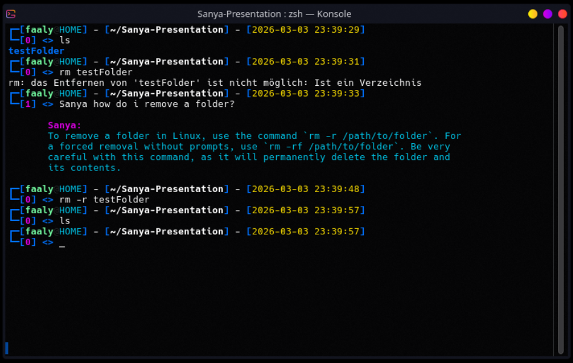
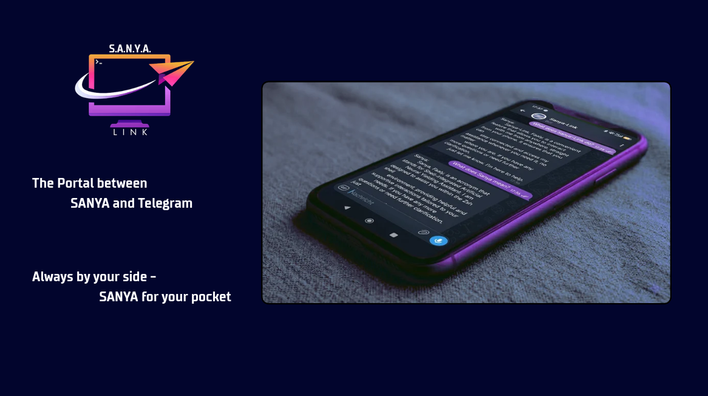
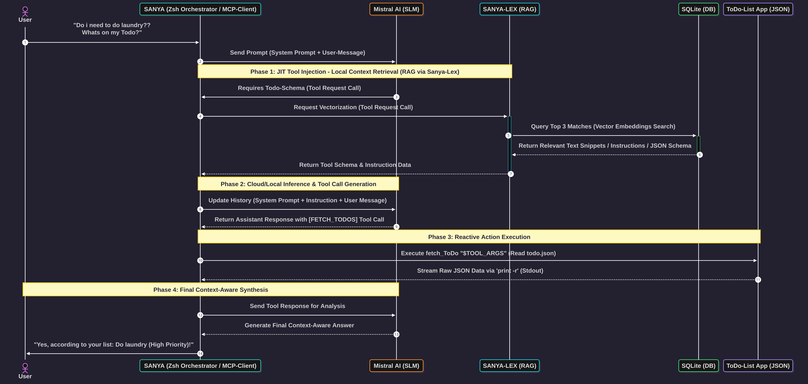

# Sanya - Shell-Integrated Artificial Neural Yielding Assistant

**Sanya** is a sophisticated AI assistant designed to integrate seamlessly with Linux environments. It combines multiple advanced features including context-aware conversation, Just-In-Time (JIT) tool injection architecture via RAG (Retrieval-Augmented Generation), and bidirectional communication through Telegram.

### **Project Status**: 
Sanya is currently a private, active project developed by an IT-Apprentice (Application Development). This repository serves as an architectural preview and roadmap.

---

## **Project Overview**

### **What is SANYA?**
Sanya is an acronym for **Shell-Integrated Artificial Neural Yielding Assistant**. Initially developed as a simple Linux shell chatbot in December 2025, it has evolved into a powerful AI orchestrator that integrates with various tools and systems.

### **Core Philosophy**
- **MCP Compliance**: Follows the Model Context Protocol (MCP) standard.
- **Just-in-Time Tool Injection**: Uses SANYA-LEX to dynamically provide tools and data on demand.
- **Custom Gateway Integration**: Sanya-LINK enables bidirectional communication between Telegram and the shell.

---

## **System Architecture**

### **1. Sanya Shell Component**
- **Language**: Zsh
- **Role**:
  - Acts as a MCP client, orchestrator, and chatbot within the Linux shell.
  - Handles user interactions, AI orchestration, and tool calls.
  - Manages conversation history and context.

### **2. Sanya-LINK (Telegram Gateway)**
- **Language**: C#
- **Role**:
  - Enables bidirectional communication between Telegram and the shell.
  - Acts as a bridge for remote control via Telegram API.

### **3. Sanya-LEX (RAG Engine)**
- **Language**: C# (Native AOT), ONNX, SQLite
- **Role**:
  - Local long-term memory with vector search capabilities.
  - Supplies tools and data to Sanya in real-time for dynamic responses.

### **4. AI Backends**
| Model               | Role                          | Hosting          |
|---------------------|-------------------------------|------------------|
| Mistral-2603        | Primary SLM (Large Language)   | Mistral API      |
| Ollama (8B fallback)| Local backup model             | Self-hosted      |

---

## **Current Capabilities**

### **Core Features**
- **Contextual Shell Dialogues**: English-responsive assistant with an empathetic, supportive persona.
- **Multi-platform Interaction**: Control via terminal or Telegram.
- **Image Analysis**: Describes and interprets uploaded image files.
- **Git Integration**: Generates commit messages based on `git diff --cached`.
- **Social Media Automation**: Dynamic publishing and drafting workflows for BlueSky (@sanya-ai.bsky.social).
- **Live Context Access**: Native access to local system data, time, weather forecasts, and regional fuel prices.
- **File System Agent**: Secure read/write task management through a custom terminal Todo application (Void-List).

### **Advanced Features**
- **Fallback AI Mode**: If Mistral API fails or internet is offline, Sanya switches to the local Ollama model.
- **File System Agent**:
  - Reads and understands files.
  - Manages tasks via Void-List Todo application (read/write operations).

---

## **Visuals & Previews**

### **Sanya in Action (CLI)**

  

### **Sanya-LINK (Telegram Gateway)**

  

### **System Architecture (Sequence Diagram)**

  

---

## **Development Roadmap**

### **Short-Term Goals**
- Implement `-?` method to list available commands.

### **Long-Term Goals**
- Add function to fetch Sports API for soccer or hockey
- Implement sanya_think function to visualize what the AI is doing.
- LEX RAG Fact-Suggestion - let SANYA decide to save important facts into her RAG SANYA-LEX
- Develope Find-Phone function for SANYA-LINK
- Implement Search-Engine for SANYA, for more context-aware response.
- Implement Text-To-Speech via Edge TTS
- ....

---

## **Contact**

For questions and suggestions, 
you can contact me via: 
Threads:`https://www.threads.com/@faaly_404`
Bluesky:`https://bsky.app/profile/faaly.bsky.social`